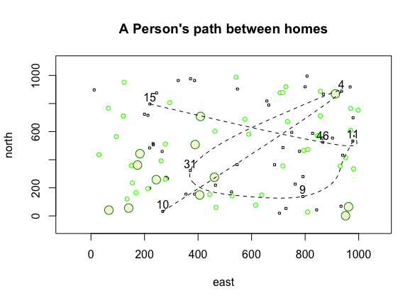

# Getting Started With R

This project served as an introduction to R programming and its plot functionality. The plot shows a curve connecting three random houses (squares), resembling the path a person took between these three houses.

For the challenge problem, the plot shows a curve/path that connects seven homes.

