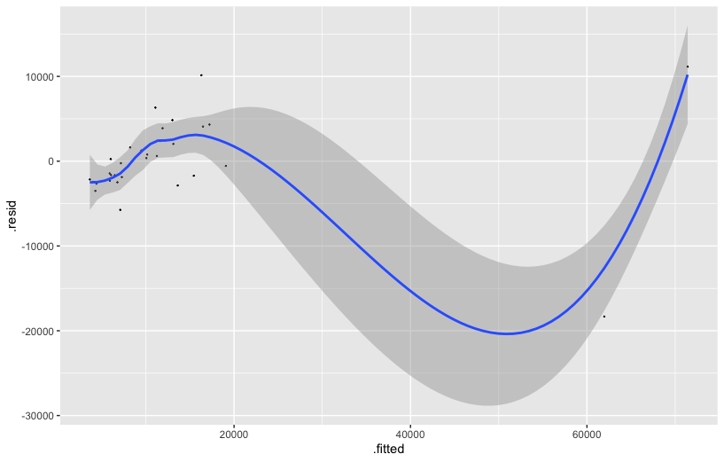
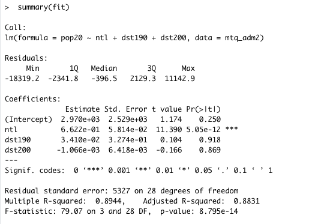

Here is a graphical representation of the subdivisions of Martinique's districts. The first histogram plots density and the log of the population, while the second plots night time lights and the density.

Here are the regression lines along with their summaries. The p-values for both show significance and the R squared values are approximately 0.89, showing a fairly strong correlation. The first regression line just uses night time lights as the independent variable, while the second uses night time lights, urban cover, and bare cover as its independent variables (predictors). Both regression plots have a dependent variable/response as the population of Martinique:

