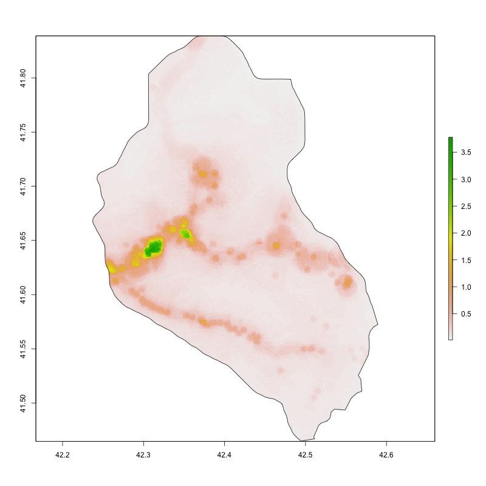
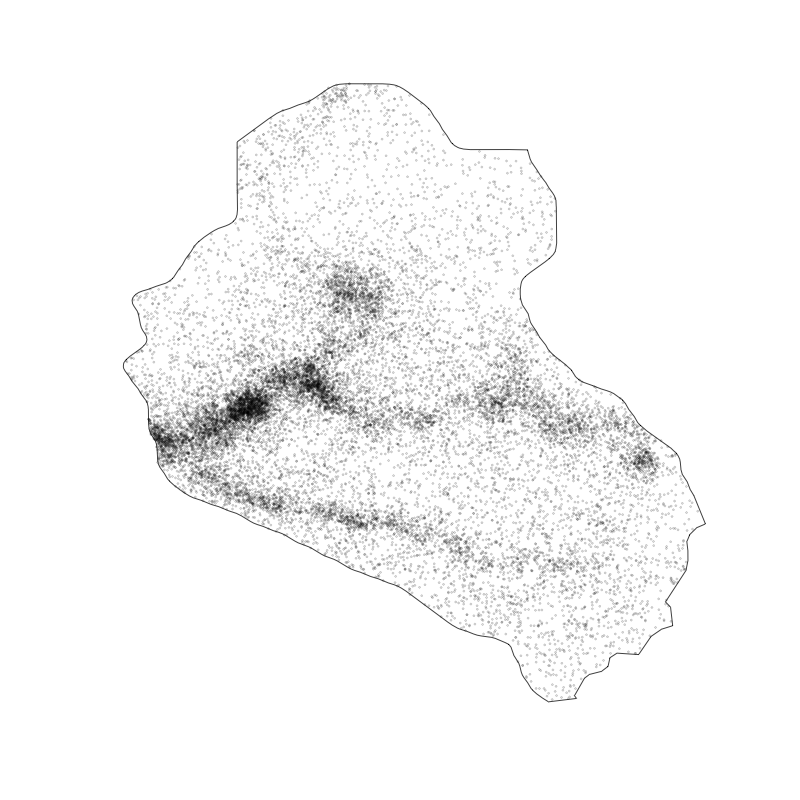
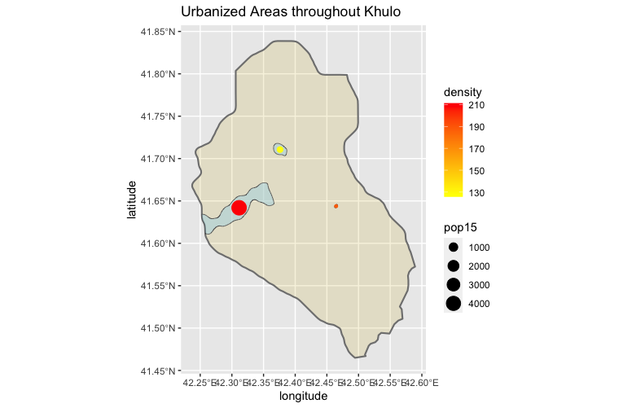
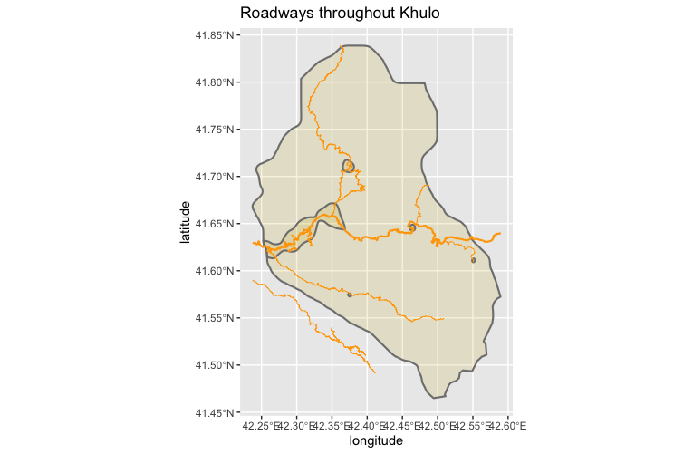
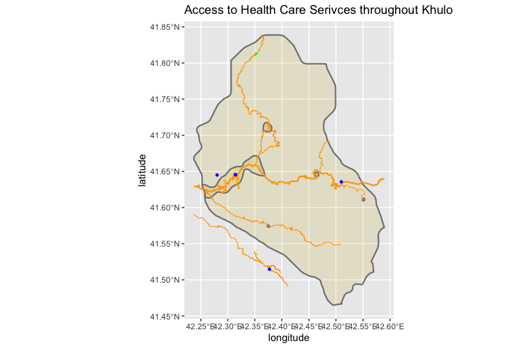

In this project I looked at the population distribution and urbanized areas in Khulo, Georgia.

This shows and describes urbanized areas through Khulo.

This describes roadways through Khulo

This plot shows healthcare facilites in Khulo. There are 5 hospitals depicted and one pharmacy. 

