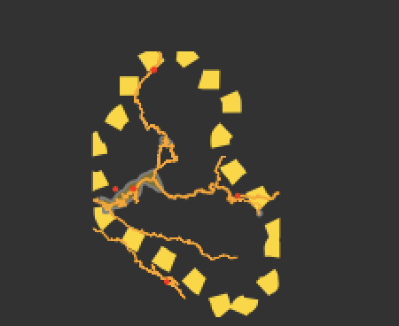

In this project I looked at the population distribution and urbanized areas in Khulo, Georgia.

This shows and describes urbanized areas through Khulo.

This describes roadways through Khulo

This plot shows healthcare facilites in Khulo. There are 5 hospitals depicted and one pharmacy. Three of the hospitals seem to primarily be located on a main highway.

For some reason my Rstudio kept crashing when I tried to add the roads and healthcare facilities to the 3D plot, but this is what I was able to produce:

