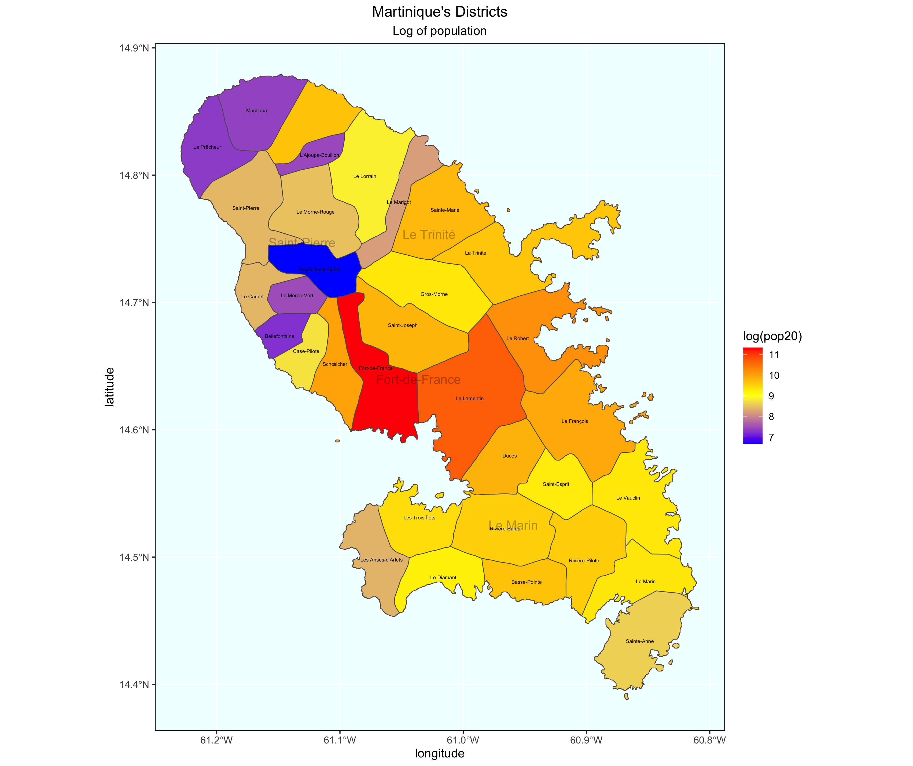
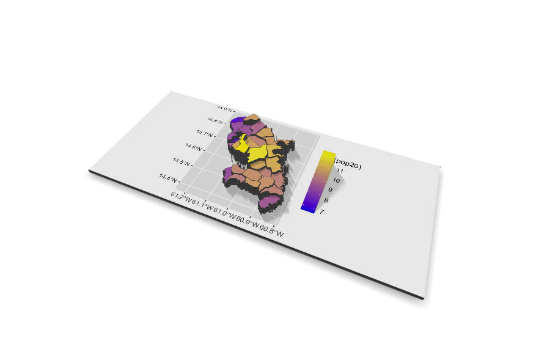

## Project Deliverable

Here is my project showing a spatial population description of Martinique. This was done by extracting populations from a raster

## Stretch Goal 1

This shows the map with Martinique, but populations are assorted by subdivisions of each district. 

## Stretch Goal 2

This map shows a spatial population description using both Martinique's districts and its subdivisions.

## Stretch Goal 3

A 3d plot of a spatial population description of Martinique

## Project Deliverable 

