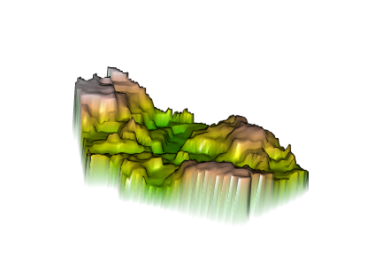

## Martinique's subdivision, Ducos

## Martinique's subdivision, Le Marin

## Martinique's subdivision, Fort-de-France

# Here are raster plots for predicted sums, means and log of the population in Martinique

## Sums

## Means

## Logarithm (For some reason, this produced very similar plots to the predicted mean)

